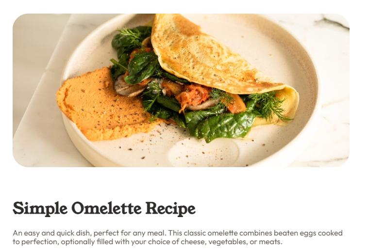

# Recipe Card | [Visit Here](https://jenieg.github.io/recipe-page/)

## Tech used:  

A responsive recipe card made with semantic HTML, CCS3 with nested rules, psuedo-selectors, and variables.

## More Projects:

Take a look at these other projects I've done:

**Social Link Card:** https://github.com/jenieg/social-link-card

**Guess that Pokemon:** https://github.com/jenieg/Guess-That-Pokemon
